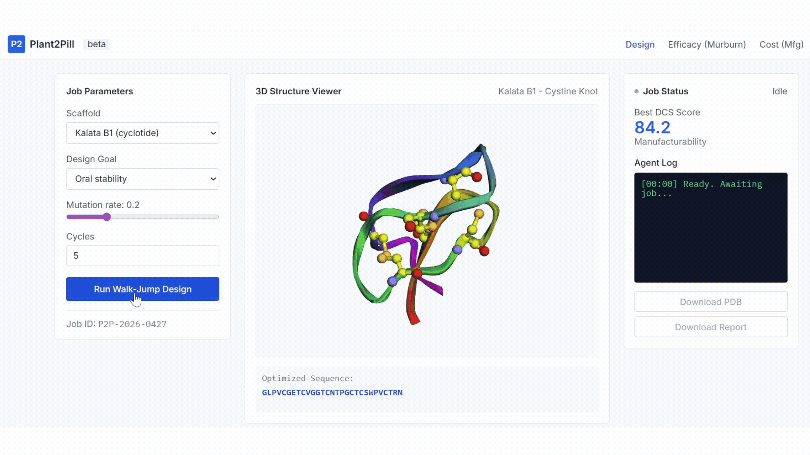

# Plant2Pill ???? : A Computational Engine for Orally Stable Cyclotide Combinatorics

> **A GitHub Universe 2026 Codebase Submission**
> Developed entirely utilizing in-browser client-heavy architecture, `Plant2Pill` brings predictive mathematical biology logic, Walk-Jump Sequence Evolution, and Live 3D PDB mapping together to engineer next-generation therapeutics. 

## The Challenge
Most biologics (peptide/protein drugs like Insulin) must be injected. If taken orally as pills, the harsh human stomach � laden with **Gastric acid (pH < 2)** and **Diffusible Reactive Oxygen Species (DROS)** attacks known as **Murburn Interactions** � cleaves linear protein backbones immediately, dropping bioavailability to 0%.

Nature solved this. The African plant *Oldenlandia affinis* produces "Cyclotides" (e.g. **Kalata B1**) � ultra-dense folded rings tied in a *Cystine Knot*. Because of the knots and the continuous ring lacking N/C termini, the stomach acid and DROS slide right off the molecule, yielding high bioavailability in the gut.

Plant2Pill turns the Cyclotide scaffold into an open-source pill chassis. 
## Demo Video
<video src="https://github.com/sanjuz-cas/plant-to-pill/raw/main/assets/demo_p2p.mp4" controls="controls" width="100%"></video>

## Features
- **Walk-Jump Engine (`index.html`):** Instead of using brute-force combinatorics (which has a 1-in-15 folding yield challenge), Plant2Pill leverages mathematical hydrophobicity/charge vectoring against the *Sequence Latent Space*. It mutates sequences in steps, queries Meta's ESMFold Atlas API to unfold its 3D state dynamically, scores the variants via DCS (Directed Cystine Scoring), and visualizes molecular mutation sequentially.
- **Murburn DROS Simulation (`murburn-analysis.html`):** A custom physics simulation that acts against the 3D-generated framework. By swapping between a *Linear Insulin* model and the *Kalata B1 Cyclotide*, users can watch DROS molecules actively cleave and oxidize structures based on their residue density.
- **Thermodynamic Yield (`cyclotide-manufacturability.html`):** A Chart.js computational interface tracking the complex thermodynamic energy and cost limits of driving disulfide combinatorics into the optimal knot vs misfolded isomers.  

## Implementation Architecture
1. **100% Client-Side:** Avoids costly biology backend APIs by executing all biochemical logic on the client. 
2. **ESMFold API:** Bypasses AlphaFold constraints through Meta's instantaneous ESMFold sequences network for sub-second fold predicting.
3. **3Dmol.js:** In-browser hardware acceleration maps dynamic mutations visually against structural constraints. 
4. **TailwindCSS:** Modern dashboard stylings. 

## Presentation Flow (How to Demo)
1. Boot to `index.html`. Explain the challenge of Oral Peptides. Click **Run Walk-Jump Design** and watch the script mutate, ping Meta API, and fold in real time natively in-browser. Explain the mutated residue mappings (Magenta strings / Yellow Nodes).
2. Swap to **Efficacy (Murburn)**. Select *Insulin-Like (Linear)*, Crank DROS Concentration to Severe. Watch it get violently destroyed (Bioavailability crashes to 0%). Swap to *Kalata B1*. Run it again�watch the Cysteine nodes physically deflect the DROS radicals while showing limited oxidation on outer sequences. 
3. Jump to **Cost (Mfg)** to show that even with high yield, we can track production scales mathematically. 

---
_A special thanks to open-source algorithmic biology protocols and the ESM fold parameters._

